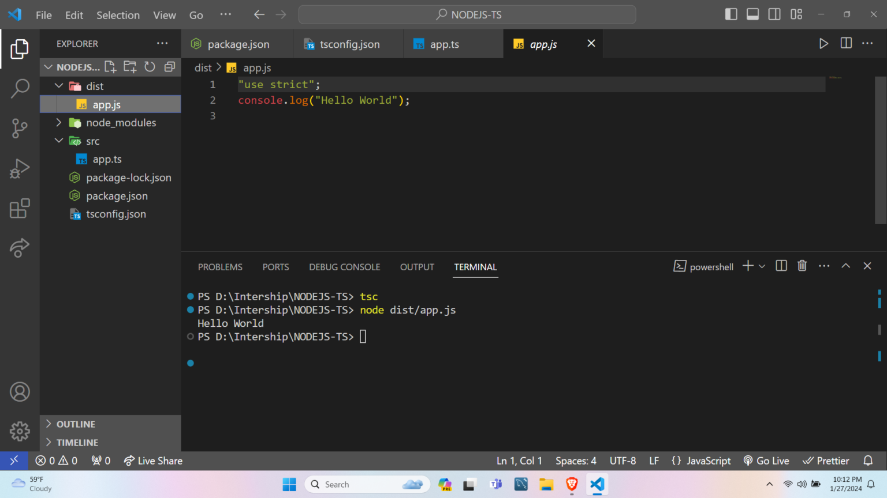

# Getting Error 'Unknown file extension ".ts" for F:\express-typescript\src\index.ts'

**In “ts-node”, the Unknown file extension “.ts” problem arises when your “package.json” file has “type”: “module” specified and by default, “ts-node” only recognizes the “commonjs” module.**

## Let’s see the troubleshooting steps to resolve this error.

 - Method 1: Using “–esm” Option

To fix it, run the TypeScript file with “ts-node –esm my-file.ts”. Using the “–esm” flag is an easy way to fix the problem. When using the “–esm” flag, “ts-node” is directed to handle TypeScript files as an ECMAScript module.

```
ts-node --esm my-file.ts
```

**Run**
```
npx ts-node --esm src/index.ts
```

**Note**: You can define a dev script in your “package.json” file to not have to remember to set the “–esm” flag every time.

```
"scripts": {
   "dev": "ts-node --esm my-file.ts"
},
```

- Method 2: Remove “type”: “module” Property

Changing the type attribute to” commonjs” or removing it from your “package.json” file is another way to fix the problem.

All “.js” files in the project are seen as ES modules when the “type” attribute is set to the “module”, which might cause an issue because “ts-node” could anticipate the “CommonJS” module by default.

**Remove 'type:module' Package.json and reset it to 'type:commonjs'**

- Method 3: Enable the ES Modules

To update inside the “tsconfig.json” file, you may specifically modify the “ts-node” option:

```
"ts-node": {
   "esm": true,
   "experimentalSpecifierResolution": "node"
},
```

In this configuration:

“esm”: true instructed ts-node to treat TypeScript files as ECMAScript modules.
“experimentalSpecifierResolution”: “node” enables module resolution in TypeScript, which can help fix problems arising from module imports.

this method is done in tsconfig.json


Making changes to the “tsconfig.json” file is a useful approach for allowing TypeScript files to function with “ts-node” without depending on the “–esm” parameter.


- Method 4: Compile TypeScript Files into JavaScript

You can prefer not to use “ts-node” and would rather use “tsc“(TypeScript Compiler) to transpile TypeScript files and then “node” to run the generated JavaScript files.

The “tsc“ command is the shorthand for the TypeScript Compiler, which is the official compiler for TypeScript. Code written in TypeScript is translated into JavaScript using it. The “node” command is used to execute JavaScript code in a Node.js runtime environment.

You may follow these steps:

Step 1: Run TypeScript Compiler – To use the TypeScript Compiler to transpile your TypeScript files into JavaScript, run the following command in your terminal:

```
tsc
```

This will transpile the TypeScript files in the given include directory using the configurations from your “tsconfig.json” file.

Note: The “.js” file is located in the specified “–outDir”.

Step 2: Run Node – you can execute the generated JavaScript files using Node. For example:


```
node dist/your-file.js
```




Lastly, we can also write a start NPM script that sequentially executes the “node” and “tsc” commands:

```
"scripts": {
    "start": "tsc && node dist/index.js"
}
```

When you use “start”: “tsc && node dist/app.js”, it will run the TypeScript compiler (tsc) and then immediately run the generated JavaScript file (app.js).